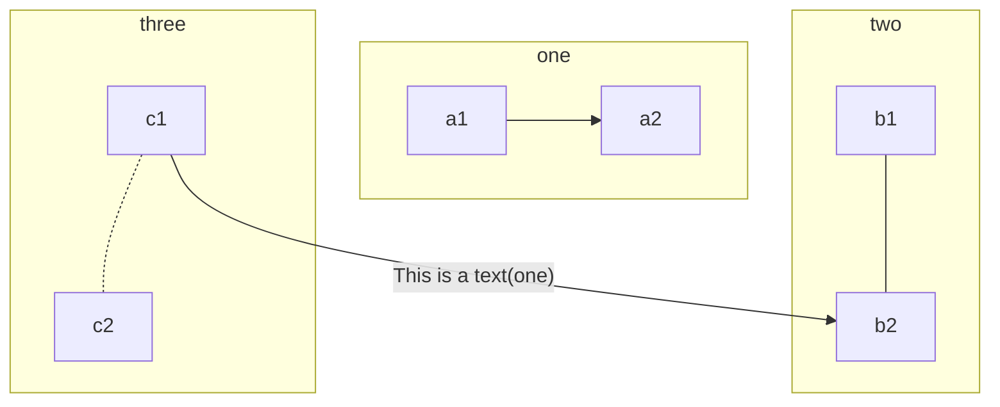
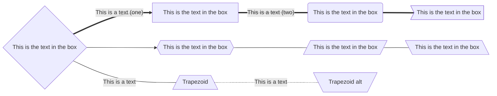
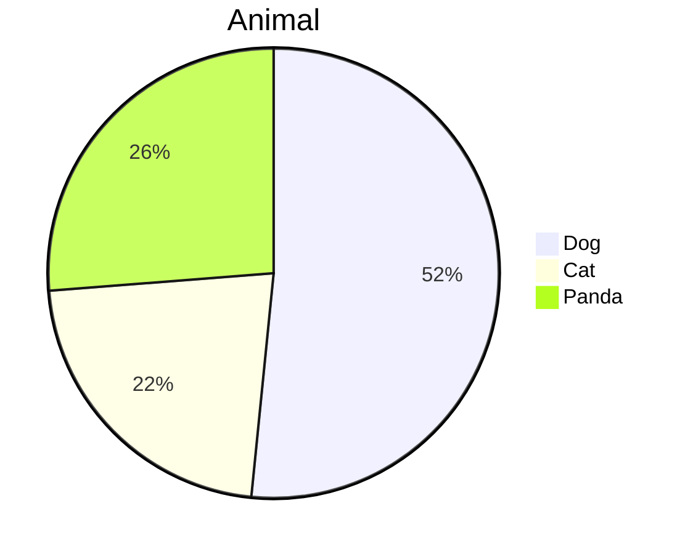

# 用Markdown画图

## mermaid格式







## 用flow格式
```flow
st=>start: Start
end=>end: End
in=>inputoutput: Input Score Number
out=>inputoutput: Output Student Count
condNot=>condition: n != -1
cond1=>condition: 1<=n<=59
cond2=>condition: 60<=n<=79
cond3=>condition: 80<=n<=89
else=>condition: else
op1=>operation: x1 += 1
op2=>operation: x2 += 1
op3=>operation: x3 += 1
op4=>operation: x4 += 1
op5=>end: End
st->in->condNot
condNot(no)->op5
condNot(yes)->cond1(no)->cond2(no)->cond3(no)->else(no)->end
cond1(yes)->op1
cond2(yes)->op2
cond3(yes)->op3
else(yes)->op4
op1->out
op2->out
op3->out
op4->out
out->end
```
