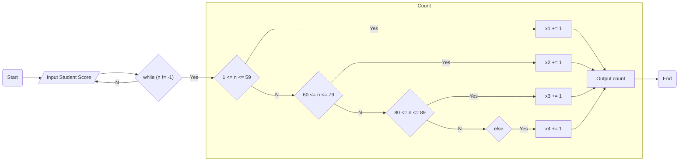

```mermaid
graph LR
Start(Start) --> Input[/Input Student Score/] --> while{"while (n != -1)"}
while --No--> Input

while --Yes--> cond1
subgraph Count
cond1{1 <= n <= 59} --Yes--> op1[x1 += 1] --> out[Output count]
cond1 --No--> cond2{60 <= n <= 79} --Yes--> op2[x2 += 1] --> out
cond2 --No--> cond3{80 <= n <= 89} --Yes--> op3[x3 += 1] --> out
cond3 --No--> else{else} --Yes--> op4[x4 += 1] -->out
end
out --> End(End)
```

```flow
st=>start: start
end=>end: end
st->end
```